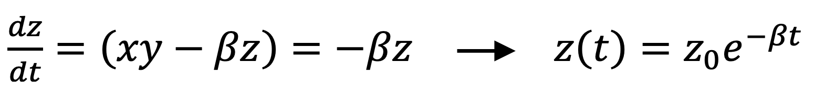
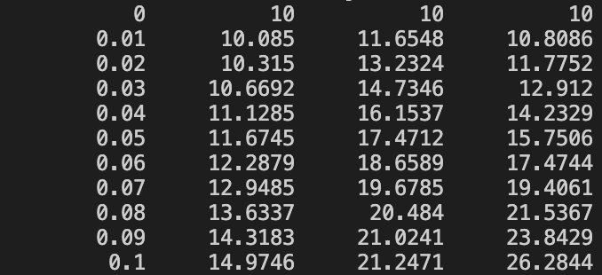
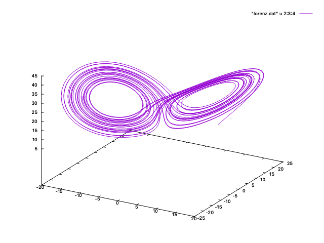
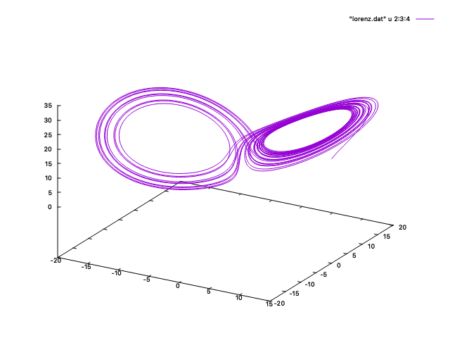
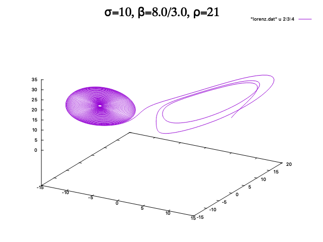
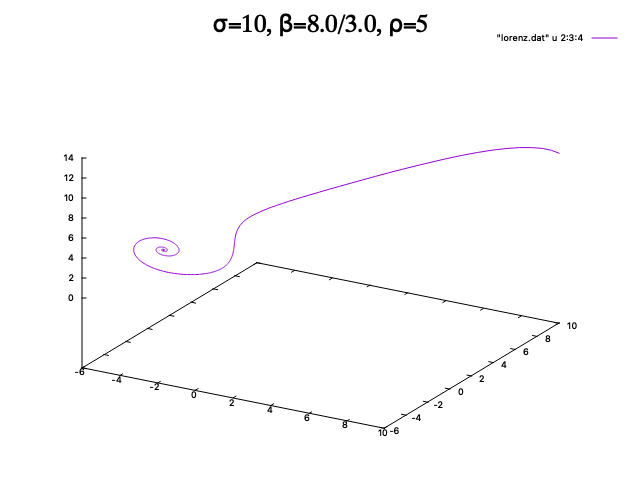
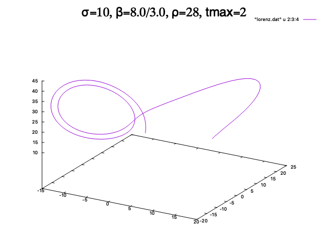
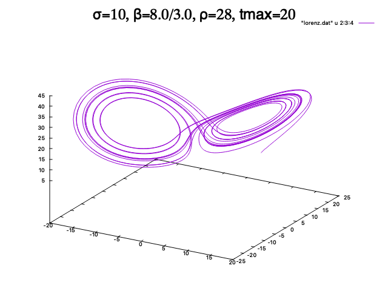
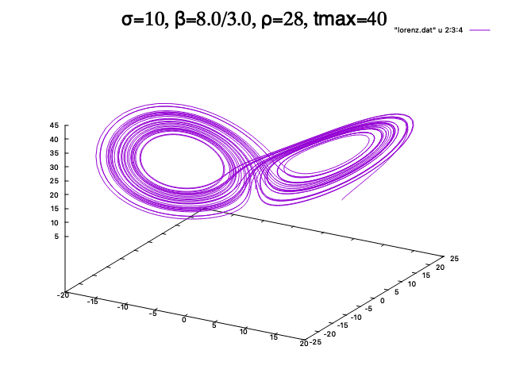

# 504-final-project-lorenz_system
Final project for PHY 504 investigating the Lorenz system and its parameters.


This repository was created as a final project for PHY 504 which explores the Lorenz system. The Lorenz system is a system ordinary differential equations known for having chaotic solutions for specifc initial conditions and parameter values. The equations and further description of the Lorenz system can be found at [https://en.wikipedia.org/wiki/Lorenz_system](https://en.wikipedia.org/wiki/Lorenz_system).


## Purpose

The purpose of this program uses an integrator to explore parameter space of the lorenz system. By varying the parameters in the problem, one can look at how two initially-close solutions compare at longer times. The integrator uses the 2nd order Runge-Kutta method, which is part of a family of iterative methods used to approximate solutions of Ordinary Differential Equations. Given some set of inital conditions, the integrator evaluates values at specific points in intervals of the specified time step. In addition, after each iteration, values are output to the terminal, allowing for the capacity to export the data with a file extension such as *.dat or *.txt. Program consists of the following files:

- GNUmakefile
- lorenz.cpp
- lorenz_test.cpp
- functions.cpp
- lorenzstate.H

The lornez.cpp file is primarily used to declare initial parameters of the system and to call functions.

The lorenz_test.cpp file establishes a set of initial parameters to check for a difference between a differentital solution and the integrator method used in this algorithm.

The functions.cpp holds the functions responsible for calcualting the derivatives, applying the 2nd order Runge-Kutta method, and writing out the data to the terminal.


## Assumptions

User has already installed or is readily avaliable to install the following libraries for the code. Chrono and Thread were only included to help delay the calculation to better emphasize the steps occuring during the test.
```c++
#include <iostream>
#include <iomanip>
#include <vector>
#include <cmath>
#include <chrono>
#include <thread>
```

Additionally, having gnuplot avaliable to run on terminal will aid in data visualization.

## Test

A basic test was implemented to help evaluate the accuracy of the data being produced due to the utilized integrator method. In order to test the accuracy of the values, coordiantes (x,y) were set to (0,0), while coordinate (z) = (constant). By doing so, the system of equations reduces down to one expression which has the solution:

<p float="center">
  
</p>

With this solution, we can compare these values to the integrator method that was implemented in this algorithm. In order to run this test, the following code can be ran in the terminal:

```
$ make lorenz_test
```

The GNUmakefile will build the executable "./lorenz_test" and execute it. Upon execution, the test will evaluate the position of z using the differnetial solution and compare this value to the value obtained using the integrator. Due to the inherent error of using an integrator, the difference of the two values was compared to a fixed value of 0.005. If the difference was less than 0.005, the two values were considered "close" and the subtest was considered as a "pass". If all tests were considered a "pass", the user would be prompted with a message that all tests have been passed. After running the test, one can run the following command to reset files within the directory:

```
$ make clean
```

## Usage

Located in the lorenz.cpp file, the following block of code below is the primary space to alter 8 parameter values. The first 5 parameters are tmax, dt, sigma, beta, and rho. The remaining 3 parameters correspond to the inital coordinates of the system.

```c++
int main() {

    // Inital parameters
    double tmax = 40;
    double dt = 0.01;
    double sigma = 10;    
    double beta = 8.0 / 3.0;
    double rho = 28;

    // Inital default coordinates set to (x,y,z) = (10,10,10)
    double init_x = 10;
    double init_y = 10;
    double init_z = 10;

    // Functions to produce data and output to terminal
    auto lorenz_history = integrate_rk2(sigma, beta, rho, tmax, dt, init_x, init_y, init_z);
    write_history(lorenz_history);

}
```

By altering these 8 parameter values, one can begin to understand how a small change in these values results in chaotic behavior. The default values are tmax = 35, dt = 0.01, sigma = 10, beta = 8.0 / 3.0, rho = 28, init_x = 10, init_y = 10, and init_z = 10. After altering these values and saving the file, the following code should be ran in the terminal:

```
$ make
```

(The following code below also works since the default build is focused on the lorenz.cpp file.)

```
$ make lorenz
```

Once the executable has been made, the executable can be ran in the terminal as:

```
$ ./lorenz
```

After running this in the terminal, one should see data displayed in the terminal.

<p float="center">
  
</p>

Following the step of displaying data, one can export the data into a .dat file. This is useful when plotting the data using gnuplot. 

```
$ ./lorenz > lorenz.dat
```

The data will be exported as lorenz.dat. In the terminal, one can now run the command to launch gnuplot.

```
$ gnuplot
```

The terminal type will now change to to 'qt' (assuming gnuplot has been properly installed). Simply run the following command in the new terminal type to display a graph of the chaotic behavior of the lorenz system.

```
gnuplot> splot "lorenz.dat" u 2:3:4 w l
```

<p float="center">
  
</p>

## Comparison of Two Initally Close Solutions 

Here is a compaision with fixed values of max, dt, sigma, beta, but slightly altered values of rho. Simply by varing the value for rho, one can notice how the behavior changes drastically.

<p float="center">
  
   
</p>

## Additional Comparisons
Additional comparisons of plots with fixed values of max, dt, sigma, beta, but altered values for rho is displayed below.

<p float="center">
  
   
</p>

<p float="center">
  
   
</p>

## Altered Time Values

Finally a comparison of plots with varying lengths of time.

<p float="center">
  
   
   
</p>

## Concluding Remarks

This repository focused on exploring the lorenz sysyem using an integrator. By slightly altering the inital parameters of the system, one can begin exploring the chaotic behavior of this system. Improved methods of obtain numerical values can be incorporated into the functions.cpp file.
