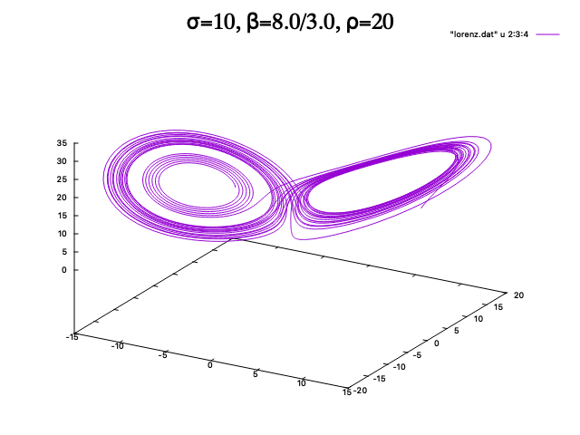
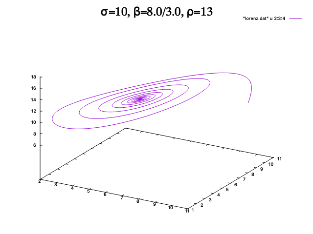

# 504-final-project-lorenz_system
Final project for PHY 504 investigating the Lorenz system and its parameters.


This repository was created as a final project for PHY 504 which explores the Lorenz system. The Lorenz system is a system ordinary differential equations known for having chaotic solutions for specifc intial conditions and parameter values. The equations and further description of the Lorenz system can be found [https://en.wikipedia.org/wiki/Lorenz_system](https://en.wikipedia.org/wiki/Lorenz_system).


## Program Purpose

The purpose of this program uses an integrator to explore parameter space of the lorenz system. By varying the parameters in the problem, one can look at how two initially-close solutions compare at longer time. The integrator uses the 2nd order Runge-Kutta method, which is part of a family of iterative methods used to approximate solutions of Ordinary Differential Equations. Given some set of inital conditions, the integrator evaluates values at specific points in intervals of the specified time step. In addition, after each of iteration, values are output to the terminal, allowing for the capacity to export the data with a file extension such as *.dat or *.txt. Program consists of the following files:

- GNUmakefile
- lorenz.cpp
- functions.cpp
- lorenzstate.H


## Assumptions

User has gnuplot installed for use in the terminal. Inital starting coordinates are (x,y,z) = (10,10,10).

## Usage

Located in the lorenz.cpp file, the following block of code below is the primary space to alter 5 parameter values: tmax, dt, sigma, beta, and rho.

```c++
int main() {

    double tmax = 35;
    double dt = 0.01;
    double sigma = 10;    
    double beta = 8.0 / 3.0;
    double rho = 28;

    auto lorenz_history = integrate_rk2(sigma, beta, rho, tmax, dt);
    write_history(lorenz_history);

}
```
By altering these 5 parameter values, one can begin to understand how a small change in these values results in chaotic behavior. The default values are tmax = 35, dt = 0.01, sigma = 10, beta = 8.0 / 3.0, and rho = 28. After altering these values and saving, the following code should be run in the terminal. 

```
$ make
```
Once the executable has been made, the following executable can be ran in the terminal.
```
$ ./lorenz
```
After running this in the terminal, one should see data displayed in the terminal.


Following the step of displaying data, one can export the data into a .dat file. This is useful when plotting the data using gnuplot. 

```
$ ./lorenz > lorenz.dat
```
The data will be exported as lorenz.dat. In the terminal, one can now run the command to launch gnuplot.

```
$ gnuplot
```
The terminal type will now change to to 'qt'. Simply run the following command in the new terminal type to display an a graph of the chaotic behavior of the lorenz system.
```
gnuplot> splot "lorenz.dat" u 2:3:4 w l
```


## Comparison between two initally close solutions 

Here is a compaision with fixed values of max, dt, sigma, beta, but slightly altered value of rho. Simply by varing the value for rho, one can notice how the behavior changes drastically.

<p float="left">
  
   
</p>

Additional comparisons of plots with fixed values of max, dt, sigma, beta, but altered values for rho is displayed below.

<p float="left">
  
   
</p>

<p float="left">
  
   
</p>


